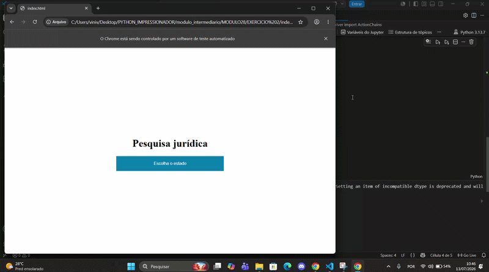

# ⚖️ Consulta de Processos Jurídicos com Python

Automação de consulta de processos jurídicos desenvolvida com 
Python, Selenium e Pandas. O script acessa um sistema web 
automaticamente, busca cada processo da lista e atualiza o 
status na tabela — sem nenhuma intervenção manual.

## 💻 Demonstração


## ⚙️ Como Funciona
1. Lê uma lista de processos do Excel com Pandas
2. Abre o sistema no navegador via Selenium
3. Seleciona a cidade correta no menu automaticamente
4. Preenche nome, advogado e número do processo
5. Interpreta o resultado do sistema
6. Atualiza a coluna "Status" com "Encontrado" ou "Não encontrado"

## 📊 Exemplo de Resultado
| Nome   | Advogado      | Processo | Cidade           | Status         |
|--------|---------------|----------|------------------|----------------|
| Lira   | Alon Lawyer   | PC6592   | Distrito Federal | Encontrado     |
| João   | Lawyer Alon   | EB3792   | Rio de Janeiro   | Não encontrado |
| Amanda | Amanda mesmo  | MM1043   | Rio de Janeiro   | Não encontrado |
| Carol  | Amanda        | PC5197   | São Paulo        | Encontrado     |

## 🛠️ Tecnologias Utilizadas
- Python 3
- Selenium (automação web)
- Pandas (leitura e atualização da planilha)
- WebDriver Manager (gerenciamento do ChromeDriver)

## ▶️ Como Executar
1. Clone o repositório
```bash
   git clone https://github.com/ViniciusCavalcanti-03/consulta-processos-python.git
```
2. Instale as dependências
```bash
   pip install selenium pandas webdriver-manager openpyxl
```
3. Adicione sua planilha `Processos.xlsx` na pasta do projeto
4. Execute o notebook ou script principal

## 👤 Autor
**Vinicius Cavalcanti Vilela Lins**  
[LinkedIn](www.linkedin.com/in/vinicius-cavalcanti-si) |
[GitHub](https://github.com/ViniciusCavalcanti-03)
